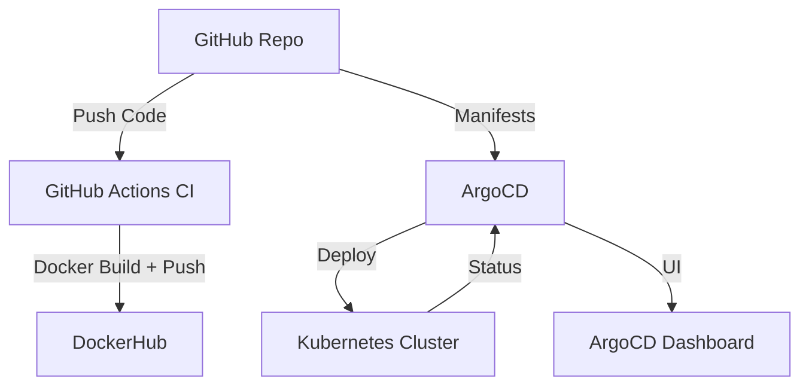

# 🚀 CI/CD with GitHub Actions & GitOps using ArgoCD on Kubernetes

[](https://argoproj.github.io/argo-cd/)  
[](https://github.com/your-username/gitops-argocd-app/actions)  
[](https://kubernetes.io/)  
[](LICENSE)

This project demonstrates full CI/CD for a Python Flask app using GitHub Actions for CI and ArgoCD for GitOps-based CD on a Kubernetes cluster running in an AWS EC2 instance via Minikube.

---

## 📌 Table of Contents

- [📦 Tech Stack](#-tech-stack)
- [✨ Features](#-features)
- [🧩 Architecture](#-architecture)
- [🛠 Prerequisites](#-prerequisites)
- [⚙️ Setup Guide](#-setup-guide)
- [🌀 GitHub Actions CI](#-github-actions-ci)
- [🖥 CD with ArgoCD](#-cd-with-argocd)
- [🔄 Testing GitOps](#-testing-gitops)
- [🐛 Troubleshooting](#-troubleshooting)
- [🤝 Contributing](#-contributing)
- [📜 License](#-license)

---

## 📦 Tech Stack

- Python (Flask)
- Docker
- Kubernetes (Minikube)
- ArgoCD
- GitHub Actions (CI)
- GitHub
- AWS EC2 (Ubuntu 22.04)

---

## ✨ Features

- ✅ CI with GitHub Actions (build & push Docker image)
- ✅ CD with ArgoCD (auto-deploy using GitOps)
- ✅ Auto-sync from GitHub to Kubernetes
- ✅ Declarative Kubernetes configs
- ✅ ArgoCD UI dashboard
- ✅ Rollbacks and revision history

---

## 🧩 Architecture



---

## 🛠 Prerequisites

- AWS EC2 Ubuntu 22.04 instance (t2.medium+)
- DockerHub account
- GitHub repo
- Open EC2 ports: 22, 8080, 30000–32767

---

## ⚙️ Setup Guide

### 1. Launch EC2 & SSH

```bash
ssh -i "your-key.pem" ubuntu@<EC2_PUBLIC_IP>
```

### 2. Install Essentials

```bash
sudo apt update && sudo apt upgrade -y
sudo apt install -y docker.io curl git
```

### 3. Install Minikube & kubectl

```bash
curl -LO https://storage.googleapis.com/minikube/releases/latest/minikube-linux-amd64
sudo install minikube-linux-amd64 /usr/local/bin/minikube
minikube start --driver=docker

curl -LO "https://dl.k8s.io/release/$(curl -s https://dl.k8s.io/release/stable.txt)/bin/linux/amd64/kubectl"
chmod +x kubectl
sudo mv kubectl /usr/local/bin/
```

---

## 🌀 GitHub Actions CI

This GitHub Actions workflow builds and pushes the Docker image on every push to the main branch.


> 🔐 Make sure to add `DOCKER_USERNAME` and `DOCKER_PASSWORD` to GitHub Secrets.

---

## 🖥 CD with ArgoCD

### 1. Install ArgoCD

```bash
kubectl create namespace argocd
kubectl apply -n argocd -f https://raw.githubusercontent.com/argoproj/argo-cd/stable/manifests/install.yaml
```

### 2. Port-Forward ArgoCD UI

```bash
kubectl port-forward svc/argocd-server -n argocd 8080:443
```

Access it via:  
`http://<EC2_PUBLIC_IP>:8080`

### 3. Get Login Password

```bash
kubectl -n argocd get secret argocd-initial-admin-secret -o jsonpath="{.data.password}" | base64 -d
```

---

## 🔄 Testing GitOps

1. Modify code or manifests
2. Commit & push to `main`
3. GitHub Actions builds & pushes Docker image
4. ArgoCD auto-syncs Kubernetes deployment

---

## 🐛 Troubleshooting

### Image not pulling?

- Create secret:
```bash
kubectl create secret docker-registry regcred \
  --docker-username=yourdockerhubusername \
  --docker-password=yourpassword \
  --docker-email=youremail@example.com
```

- Reference in `deployment.yaml`:
```yaml
imagePullSecrets:
  - name: regcred
```

### ArgoCD pod issues?

```bash
kubectl get pods -n argocd
kubectl describe pod <pod-name> -n argocd
```

---

## 🤝 Contributing

1. Fork it 🍴  
2. Create your feature branch 💡  
3. Commit your changes ✅  
4. Push to the branch 🚀  
5. Open a Pull Request 🔁

---

## 📜 License

This project is licensed under the MIT License - see the `LICENSE` file for details.
